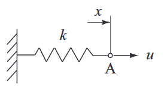

==========
モデリング
==========

------------
静的システム
------------

静的システムは、現在の出力が現在の入力のみで決まるもの。

線形ばね
--------

フックの法則(変位と復元力は比例する) が成り立つばね。

   ばね系([SYSCON_2009]_ の図 2.5 より引用)

- :math:`A`: 今回注目する点
- :math:`u`: 点 :math:`A` にかかる力
- :math:`x`: 点 :math:`A` の変位
- :math:`k`: ばね定数

「変位と復元力は比例する」から、 :eq:`spring_1` が成り立つ。

.. math::
   :label: spring_1

   u = kx

これは :eq:`spring_2` のように変形できる。

.. math::
   :label: spring_2

   \frac{u}{k}  &= x\\
   \frac{1}{k}u &= x

.. math::
   :label: spring_3

   x = \frac{1}{k}u

:eq:`spring_3` から、点 :math:`A` を変位 :math:`x` にとどめたければ、
変位に比例した力で引っ張らないといけないということがわかる。

------------
動的システム
------------

入力に対し、出力が微分方程式で求まるもの。例えば、出力の計算に速度(変位の微分)が必要なものは動的システム。

一次系
------

ダンパー
^^^^^^^^

ダンパーは、速度に比例した抵抗力(粘性減衰係数)を発生する装置。
急な加減速を抑制するために使うイメージ。

.. figure:: ./image/dampar.png

   ダンパー系([SYSCON_2009]_ の図 3.8 より引用)

- :math:`A`: 今回注目する点
- :math:`u(t)`: 時刻 :math:`t` 時点での、点 :math:`A` にかかる力
- :math:`x(t)`: 時刻 :math:`t` 時点での、点 :math:`A` の変位
- :math:`\dot{x}(t)`: 時刻 :math:`t` 時点での、点 :math:`A` の速度
- :math:`c`: 粘性減衰係数

「速度に比例する抵抗力を発生する」から、 :eq:`dampar_1` の式が成り立つ。

.. math::
   :label: dampar_1

   u(t) = c\dot{x}(t) \\

:eq:`dampar_1` を :eq:`dampar_2` の通り変形すると、 :eq:`dampar_3` の式が導ける。

.. math::
   :label: dampar_2

   u(t)            &= c\dot{x}(t) \\
   \frac{u(t)}{c}  &= \dot{x}(t) \\
   \frac{1}{c}u(t) &= \dot{x}(t)

.. math::
   :label: dampar_3

   \dot{x}(t) = \frac{1}{c}u(t)

:eq:`dampar_3` から、目標の速度を出すためには、粘性減衰係数に負けないように頑張る必要がある事がわかる。

.. todo:: ダンパー有り無しで変位がどう変わるかをグラフで表現する。
